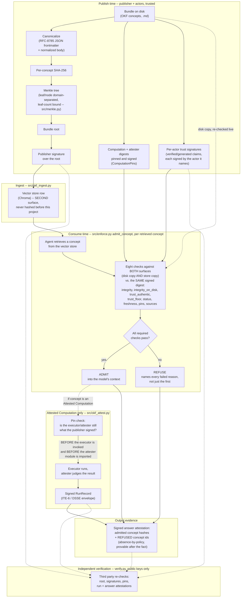

# Architecture: the trust boundary

This is the one-diagram version of what [`src/enforce.py`](../src/enforce.py)'s `admit_concept` does
and why. Read the README first for the demo and the eight checks in prose; this page is the shape of
the pipeline those checks sit inside.

## Why the shape is this shape

- **Two surfaces, one signed digest.** The disk copy and the vector-store copy are independently
  anchored against the *same* publisher-signed digest (solid arrows into `CHECKS` from both `BUNDLE`
  and `STORE`). An attacker has to compromise both to move either — see
  [docs/FINDING-attestation-integrity.md](FINDING-attestation-integrity.md) for what happens when only
  one is checked.
- **Pin-before-import, not pin-then-run.** `PINCHECK` gates `RUN` before the executor or attester code
  ever executes. A refusal that happens after the bundle's code has already run is not a control —
  see the `pins` check in the README's enforcement table.
- **Identity is authenticated, not read off the page.** `TRUST` signatures feed `CHECKS` alongside the
  content digest, so `trust_floor` gates on the tier a signature actually backs, not the tier a
  `verified:` string merely claims.
- **Refusal is evidence, not silence.** `REFUSE` still flows into `ANSWER` — the signed attestation
  names every concept that was kept out, so a third party can later prove a concept was excluded
  *by policy*, not just absent.
- **What this diagram does not show:** key distribution, rotation, revocation, or delegation — there
  is no TUF-style trust root yet. See [docs/THREAT_MODEL.md](THREAT_MODEL.md) and
  [docs/OKF_COMPATIBILITY.md](OKF_COMPATIBILITY.md) for what's assumed rather than enforced.
